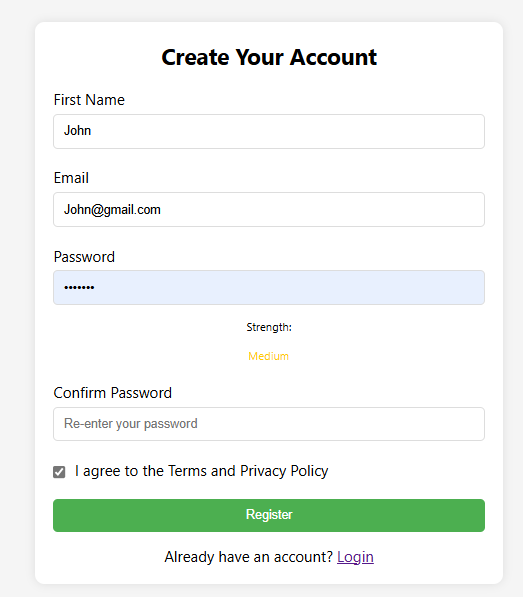
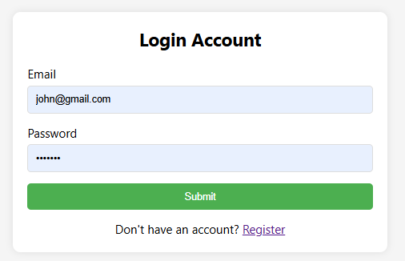
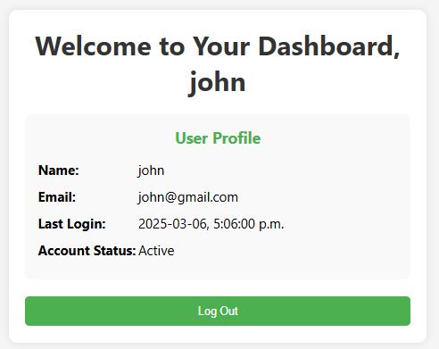
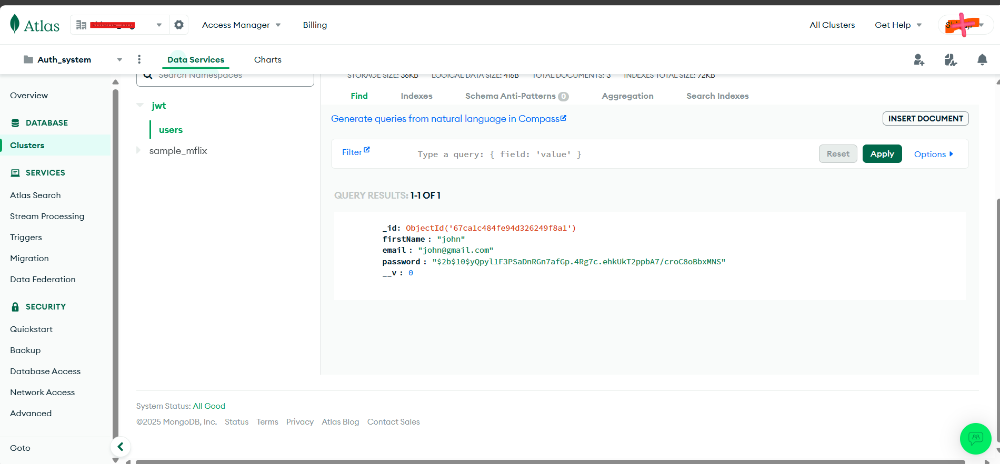

# 🔒 JWT Authentication System


A secure authentication system using JWT, MongoDB Atlas, and React - providing registration, login, and protected routes with minimal setup.

## ✨ Features

- 👤 **User Authentication**: Registration and login
- 🔐 **Protected Routes**: JWT verification
- 🔒 **Secure Storage**: Password hashing with bcrypt
- ☁️ **Cloud Database**: MongoDB Atlas integration
- 📱 **Responsive Design**: Works on all devices

## 🚀 Quick Start

### Prerequisites
- 🟢 Node.js
- 🗄️ MongoDB Atlas account

### Installation

1. **Clone & Install:**
   ```sh
   git clone https://github.com/Shivah99/jwt-auth-mongodb.git
   cd jwt-auth-mongodb
   ```

2. **Setup Server:**
   ```sh
   cd server
   npm install
   ```

3. **Setup Client:**
   ```sh
   cd ../client
   npm install
   ```

4. **Configure Environment Variables:**
   Create a `.env` file in the server directory based on `.env.example`:
   ```sh
   MONGODB_URI=your_mongodb_atlas_connection_string
   JWT_SECRET=your_jwt_secret_key
   ```

5. **Start Server:**
   ```sh
   cd ../server
   npm start
   ```

6. **Start Client:**
   ```sh
   cd ../client
   npm start
   ```

7. **Access Application:**
   Open your browser and navigate to: `http://localhost:3000`

## 📷 Screenshots

> ℹ️ **Note:** To add screenshots of your application:
> 1. Create a `screenshots` directory in the project root
> 2. Take screenshots of your application's pages
> 3. Save them as PNG files with the following naming convention:
>    - `register.png` - Registration page
>    - `login.png` - Login page
>    - `dashboard.png` - Dashboard
>    - `MongoDB.png` - MongoDB data view

*The following are placeholder references. Replace with your actual screenshots.*

### 📝 Registration Page


### 🔑 Login Page


### 🖥️ Dashboard


### 🗄️ MongoDB


## 🔒 Authentication Flow

1. **Registration:**
   - User enters email and password
   - Password is hashed using bcrypt
   - User is stored in MongoDB Atlas
   - JWT token is generated and stored in cookies
   - User is redirected to Dashboard

2. **Login:**
   - User enters credentials
   - Server validates against stored data
   - If valid, JWT token is generated and stored in cookies
   - User is redirected to Dashboard

3. **Authentication Check:**
   - Protected routes verify JWT token in cookies
   - If token is valid, access is granted
   - If token is invalid or missing, redirect to login

4. **MongoDB Data Storage:**
   - User data is securely saved in MongoDB Atlas clusters
   - Database automatically scales as your user base grows
   - Data is replicated across multiple servers for reliability
   - All sensitive information is encrypted and protected

## 🔧 Project Structure

```
mongodb_auth/
├── client/
│   ├── public/
│   │   ├── index.html
│   │   └── manifest.json
│   └── src/
│       ├── pages/
│       │   ├── Login.js
│       │   ├── Register.js
│       │   └── Secret.js
│       ├── App.js
│       ├── index.js
│       └── index.css
│
├── screenshots/      # Directory for application screenshots
│   ├── register.png
│   ├── login.png
│   ├── dashboard.png
│   └── MongoDB.png
│
└── server/
    ├── config/
    │   └── config.js
    ├── controllers/
    │   └── authControllers.js
    ├── middlewares/
    │   └── authMiddlewares.js
    ├── models/
    │   └── userModel.js
    ├── routes/
    │   └── authRoutes.js
    ├── .env
    ├── .env.example
    └── index.js
```

## ⚠️ Security Notes

- The `.env` file containing your MongoDB connection string and JWT secret should **never** be committed to version control
- For production, use environment variables set on your hosting platform
- Set `httpOnly: true` for cookies in production
- Consider implementing rate limiting for login attempts
- Use HTTPS in production environments

## 📝 License

[MIT](LICENSE)

## 👨‍💻 Author

Shivaji - [GitHub Profile](https://github.com/Shivah99)